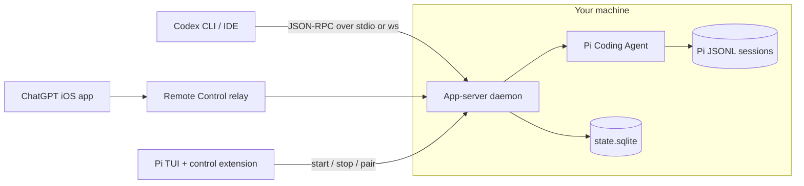

# Pi Codex App Server

[](https://www.npmjs.com/package/pi-codex-app-server) [](LICENSE) [](https://nodejs.org) [](https://pi.dev)

Talk to [Pi Coding Agent](https://pi.dev) from anything that speaks the Codex app-server protocol: the Codex CLI, Codex IDE extensions, and the ChatGPT mobile app over Remote Control.

This is an adapter, not a Codex reimplementation. Pi still picks the models, runs the tools, enforces the permissions, and owns the session history. This project speaks Codex JSON-RPC on one side, calls Pi on the other, and keeps a small SQLite sidecar for the handful of things Codex clients expect that Pi has no concept of, such as project catalogs and archived threads.

## Features

- **Two transports.** Run it over stdio for a local Codex client, or as a background daemon on a WebSocket port that survives Pi session changes and extension reloads.
- **Connected host for ChatGPT.** Enroll with OpenAI Remote Control, show a QR code in the Pi TUI, and drive your machine from the ChatGPT iOS app.
- **Every Pi model.** `model/list` returns Pi's whole model registry, including non-OpenAI providers, with the reasoning levels each model actually supports. Selections pass through to Pi without rewriting or silent fallback.
- **Pi history, projected on demand.** Pi's JSONL sessions stay the source of truth. Threads, turns, and items are computed from them when a client asks.
- **One credential.** Pi owns the OpenAI OAuth token. This server borrows it and routes logout back through Pi, so two stores never rotate the same refresh token.
- **No `Method not found`.** Codex methods without a Pi equivalent return schema-valid neutral results, validated by Ajv against the official Codex JSON Schemas.
- **Controlled from inside Pi.** A `/codex-server` command starts, stops, inspects, and pairs the daemon without leaving the TUI.

## How it works



The daemon accepts Codex JSON-RPC connections and dials out to the Remote Control relay at the same time, so a paired phone and a local Codex client share the same sessions. A Pi session only ever has one writer, and today that writer is the daemon. The lease table in SQLite is there for the next step, handing ownership to an active Pi TUI so the two never rewrite the same JSONL at once. See [ADR 0009](docs/adr/0009-use-a-single-writer-for-shared-sessions.md).

## Getting started

### Prerequisites

- [Node.js](https://nodejs.org) 22.5 or newer. The metadata store uses `node:sqlite`, so Node 24 is the smoother choice and drops the experimental warning.
- [Bun](https://bun.sh) 1.2 or newer to install dependencies and build.
- [Pi Coding Agent](https://pi.dev) installed and logged in.

> [!IMPORTANT] Pairing with ChatGPT needs Pi's `openai-codex` OAuth login. Run `pi` and sign in to ChatGPT there first. An API key will not do: the enrollment call reads the account id out of the OAuth token's claims.

### Install

Install it as a Pi package:

```bash
pi install npm:pi-codex-app-server
```

Pin a version with `pi install npm:pi-codex-app-server@0.1.0`, or add `-l` to install into the current project instead of your global Pi setup.

Start Pi and the extension takes it from there. It launches the daemon on session start and puts the status in the footer:

```
Codex server: running · ws://127.0.0.1:53412
```

### Pair with ChatGPT

Inside Pi:

```
/codex-server pair
```

Scan the QR code with the ChatGPT app, or type the manual code it prints underneath. Codes expire, and the widget shows when.

### Connect a local Codex client

The Pi package ships a `pi-codex-app-server` binary. Install it on your `PATH` if a client needs to spawn it directly:

```bash
npm install -g pi-codex-app-server
```

Then point any Codex-compatible client at it and let the client own stdio:

```bash
pi-codex-app-server app-server
```

Or attach to the shared daemon over WebSocket. `/codex-server status` prints the URL, and it is also in `endpoint.json`.

## The `/codex-server` command

| Subcommand | What it does |
| --- | --- |
| `start` | Spawn the daemon if it is not already running, then wait for it to be reachable |
| `stop` | `SIGTERM` the daemon and remove the endpoint file |
| `status` | Default. PID, WebSocket URL, start time, autostart and Remote Control flags, current Pi session id, file paths |
| `pair` | Request a ChatGPT Remote pairing code and render it as a QR code |

## CLI

```
pi-codex-app-server [command]
```

| Command | What it does |
| --- | --- |
| _(none)_ | Same as `app-server` |
| `app-server` | Serve the Codex app-server protocol over stdio |
| `daemon` | Listen on WebSocket, write `endpoint.json`, print the URL, and connect the Remote Control relay |
| `pair` | Print a pairing code and its expiry, then exit |

Logs go to stderr as JSON Lines. Email addresses and JWTs are redacted on the way out.

## Configuration

Everything is environment variables. The config is parsed with Zod at startup, so a bad value fails loudly instead of silently defaulting.

| Variable | Default | Purpose |
| --- | --- | --- |
| `PI_CODEX_APP_SERVER_AUTOSTART` | `1` | Set `0` to stop the extension from launching the daemon on session start |
| `PI_CODEX_APP_SERVER_HOME` | `<pi agent dir>/codex-app-server` | Where state, the endpoint file, and logs live |
| `PI_CODEX_APP_SERVER_HOST_NAME` | machine hostname | Name this connected host reports |
| `PI_CODEX_APP_SERVER_LISTEN` | `ws://127.0.0.1:0` | Daemon listen URL. Port `0` picks a free one |
| `PI_CODEX_REMOTE_CONTROL` | `1` | Set `0` to run purely local and skip enrollment |
| `PI_CODEX_REMOTE_BASE_URL` | `https://chatgpt.com/backend-api/` | Remote Control API base, useful for testing |

> [!NOTE] `PI_CODEX_APP_SERVER_LISTEN` accepts `wss://`, but the daemon refuses to terminate TLS itself. Put a local proxy in front of it if you need that.

### Files on disk

Under `PI_CODEX_APP_SERVER_HOME`:

| Path | Contents |
| --- | --- |
| `state.sqlite` | Projects, thread metadata, writer leases, enrollment and pairing state. No conversation content |
| `endpoint.json` | PID, WebSocket URL, and start time of the running daemon. Written with mode `0600` |
| `logs/` | Created for the daemon. The server itself writes to stderr |

## Protocol coverage

Built against the vendored Codex app-server protocol v2 schemas in [vendor/openai-codex-app-server-protocol/](vendor/openai-codex-app-server-protocol/), tracking Codex `0.149.0`. The method map in [src/protocol/generated/codex-methods.ts](src/protocol/generated/codex-methods.ts) is generated from the official request definitions, so method names, params, and responses line up at compile time.

Implemented today:

- Lifecycle: `initialize`, `initialized`, `account/read`, `account/logout`, `model/list`, `modelProvider/capabilities/read`
- Threads: `thread/list`, `thread/read`, `thread/start`, `thread/resume`, `thread/loaded/list`, `thread/name/set`, `thread/compact/start`, `thread/archive`, `thread/unarchive`, `thread/delete`, `thread/unsubscribe`
- Turns: `turn/start`, `turn/steer`, `turn/interrupt`
- Streaming notifications: `thread/started`, `thread/name/updated`, `turn/started`, `turn/completed`, `item/started`, `item/completed`, `item/agentMessage/delta`, `item/reasoning/textDelta`

Two details worth knowing if you are reading the wire. Codex omits the `"jsonrpc":"2.0"` member, so this server adds it only while a message is inside the `json-rpc-2.0` library and strips it before sending. Cancellation is the protocol-level `turn/interrupt` request, not `$/cancelRequest`.

> [!WARNING] Codex-only settings such as sandbox mode and approval policy are accepted and then ignored. Sessions run with Pi's execution semantics, and the server reports Pi's effective state back. It will not invent a security guarantee it cannot enforce. If you rely on Codex sandboxing, this is not a drop-in replacement.

Archiving is metadata-only and leaves the Pi JSONL alone. `thread/delete` is not: it deletes the Pi session file for real, matching Codex semantics.

## Platform support

Windows x64 is the primary target, with macOS arm64 and x64 next. Linux should work, since the transport is portable, but ChatGPT Remote documents Windows and macOS hosts, so treat it as experimental.

## Development

```bash
bun install
bun run test        # vitest
bun run typecheck   # tsc --noEmit
bun run check       # ultracite (oxlint + oxfmt)
bun run fix         # autofix
bun run build       # bun build into dist/
```

A pre-commit hook runs `ultracite fix` over staged files, so formatting arguments never reach review.

### Layout

```
src/
  cli.ts                 Entry point, wires commands to config
  server/                AppServer, method registration, stdio and daemon runners
  pi/                    Pi adapter: model catalog, live sessions, history projection
  protocol/              JSON-RPC connection, generated method map, Ajv validation
  remote/                Remote Control enrollment, pairing, relay transport
  transports/            stdio and WebSocket message transports
  storage/               SQLite metadata sidecar
  extension/             Pi extension: /codex-server command and daemon control
scripts/                 Build and codegen
vendor/                  Official Codex protocol schemas and generated types
docs/adr/                Why things are the way they are
```

The [ADRs](docs/adr/) are short and worth skimming before you change behavior. They cover the decisions that are easy to undo by accident, such as who owns credentials, why the daemon is separate from the extension, and why the adapter never rewrites a model request.

## Troubleshooting

**The footer says "startup failed".** Run `/codex-server status` for the details. A stale `endpoint.json` pointing at a dead PID reads as stopped and the next `start` overwrites it, so the more likely cause is the port in `PI_CODEX_APP_SERVER_LISTEN` already being taken. The daemon also has 10 seconds to become reachable before the extension gives up.

**Pairing fails with "requires Pi OpenAI OAuth login".** Pi has no `openai-codex` credential. Sign in to ChatGPT from Pi and try again.

**The daemon starts but the phone never connects.** Check `PI_CODEX_REMOTE_CONTROL` is not `0`. The relay reconnects with backoff from 1s up to 30s, so give it a moment after a network drop.

**A model the client shows does not work.** Selections go to Pi unchanged and fail loudly when unavailable, on purpose. Confirm the provider is configured in Pi with `pi` itself first.

## Related

- [Pi Coding Agent](https://pi.dev) and its [extension docs](https://github.com/badlogic/pi-mono)
- [openai/codex](https://github.com/openai/codex), the behavioral reference for the app-server protocol
- [CONTEXT.md](CONTEXT.md) for the vocabulary this codebase uses and the terms it deliberately avoids
